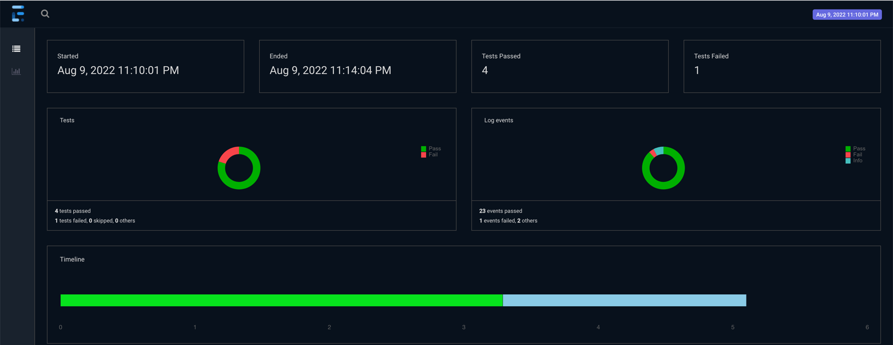
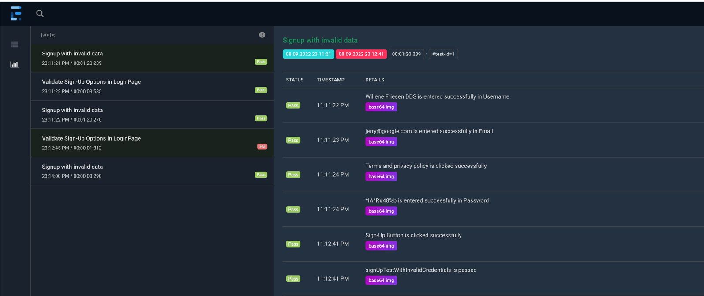
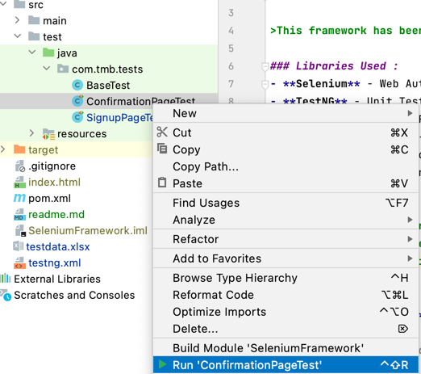

# Amazon UI Automation

>This framework has been designed to automate functional flows of WebApplication and, ensure coverage and quality

### Libraries Used :
- **Selenium** - Web Automation
- **TestNG** - Unit Testing Library
- **Extent Reports** - Reporting Library to generate beautiful html reports
- **WebDriverManager** - Executables management
- **Owner Library** - To manage configurations from properties file
- **Data Supplier** - To read data from external file and provide the data to respective tests as Dataprovider

### Capabilities:
> - Web Tests can be run on chrome or firefox browsers.
> - Configuration can be changed from config.properties inside src/test/resources
> - Test run can be customized from testng.xml by updating browser type as Chrome, Firefox or Grid
> - Support to run tests in Docker containers
> - Utility methods available for Web Interactions (SeleniumUtils.java)

### Running Tests:
**[Prerequisites]()**: **Java 8+**

    1. Running Tests Individually
     
     Go to src/test/java and Open any Java class that ends with '.*Test'. Right click to select the class/test and run as TestNG test and test will execute locally as follows:

 
    2. Running Tests from testng.xml

     Open testng.xml file located in the root directory and right click to select the xml file and run as TestNG tests. The tests will start running based on thread-count value defined in testng.xml

    3. Running Tests in Selenium Grid using Docker-Compose file

     Open terminal and navigate to project root directory. Run the following command to first setup Selenium Grid Infra:

        a. docker compose -f docker-compose-v3.yml up --scale chrome 3
        b. To view grid UI, open any browser and access URL: http://localhost:4444/grid/console, which will display the GRID infra

     Open testng-grid.yml file located in the root directory and right click to run as TestNG tests on Grid infra. The tests will start running and execution can be viewed in Grid UI

### Report Generation:

Once test execution is complete, the framework will generate report at the root of project directory as `index.html`. This reports hold all the information about the tests on Pass, Fail and Skip. Also for failed tests it will attach screenshot of the page where tests got failed. 
Following is a sample of report generated:

